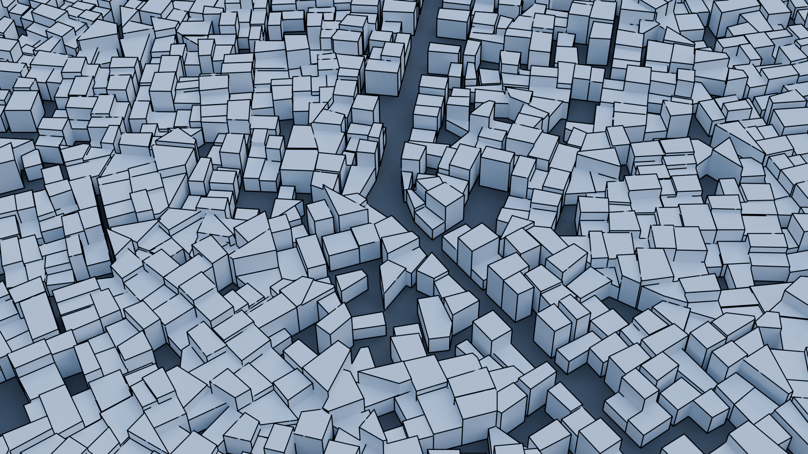
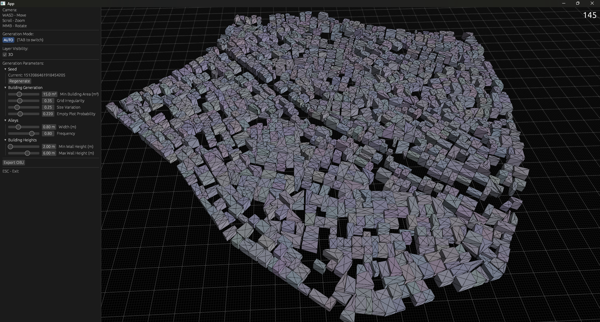

# WeaverGen V3

A procedural slum generator as part of a student paper written in Rust with [bevy](https://github.com/bevyengine/bevy).

Voronoi diagrams are used as the basis of the building layouts and are created using [spade](https://crates.io/crates/spade). Roads and boundaries are based on CVTs from [this paper](https://www.microsoft.com/en-us/research/wp-content/uploads/2016/12/Efficient-Computation-of-Clipped-Voronoi-Diagram-and-Applications.pdf). A second pass is then applied to extrude the layout upwards. Older versions of this project did not have the boundary constraint system. Major important algorithms can be found in `/mesh`.

Future work might focus on modifying the building geometries themselves (porches, roofs, facades). Though I might try to refactor this project into my C++ engine instead.

- *WASD* to move camera
- *MMB* to rotate camera
- *Tab* to switch auto vs manual modes
- *Q/E* to switch manual submodes
- *Click and Drag* to interact

Also inside: an OBJ file exporter if you would like to use the generated meshes in your own projects :)

Additional Images and goodies in `/docs`
